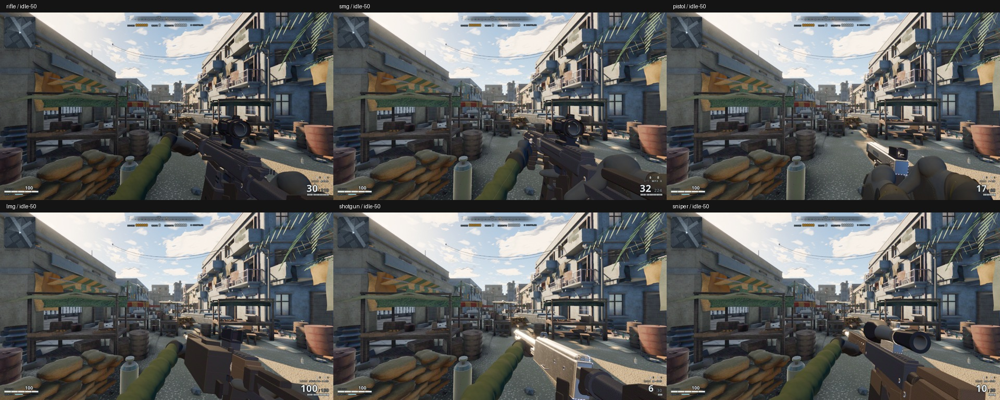

# Blender player hands and arms

First-person charcoal tactical gloves and olive combat sleeves, integrated with
all six playable weapons. MCX Virtus is the visual reference, **not** an additional
weapon integration.

## Open / review

- **`player-arms.blend`** — editable deformation meshes, armature, packed PBR
  textures, twelve animated pose actions, studio camera/lights and a START HERE
  text block. Authored with Blender 5.2.
- **`../../../public/models/player/arms.glb`** — the committed runtime asset
  (repository path: `public/models/player/arms.glb`).
- **`review/gripPistol.png`**, **`overview.png`** — Blender renders, not game frames.
- **`review/pose-library.mp4`** — Blender's twelve contact-pose actions, in manifest
  order. This is a finger-pose reel, **not** complete weapon reload performances.
- **`review/weapons-in-game.jpg`**, **`review/actions-in-game.jpg`** — actual game
  captures using its viewmodel lighting and committed weapon models.
- **`review/capture-report.json`** — 138 sampled in-engine weapon/action states.



## What changed

- Replaced runtime-built rigid finger capsules and sleeve pieces with Blender
  deformation meshes: welded glove shell, separate digits, a thumb web, sewn
  reinforcement panels, knuckle protection, cuff binding and a continuous sleeve.
- 27 named controls per arm, including nine half-angle flex controls to retain
  knuckle volume under Three.js linear skinning. No dual-quaternion-only tricks.
- Baked albedo, roughness, tangent-space micro-normal maps and unique self-AO.
  Separate UV sets keep textile detail density independent of AO atlas packing.
- Five material submissions and one shared skeleton per arm. The current GLB
  has **46,611 exported vertices per arm**, including UV/material splits.
- Evaluated Blender contact poses and sampled ease curves drive runtime finger
  transitions. Interrupted blends start from the displayed pose.
- Trigger flex no longer overwrites reload/inspection/utility finger poses and
  is reduced to a small press rather than a large curl.
- Corrected pistol/SMG wrist sockets, added a pistol trigger grip, revised its
  support cup, and restored per-weapon contact poses at reload return keys.
- Right-hand clip weights now blend position/orientation instead of switching
  abruptly at a 0.5 threshold. Radio contact is immediate when the radio appears.

## Animation contract

Blender authors the skin, twelve contact-pose actions and their eased finger
approach. `src/weapons/hand-poses.js` is generated from evaluated Blender actions,
not manually edited runtime pose data. `pose-reference.json` is the reproducible
authoring input for the generator.

Existing gameplay-owned weapon trajectories, two-bone arm IK, event timings,
magazine handoffs, grenade releases and radio lifecycle remain in the game. Full
reload/inspect/root trajectories have **not** been replaced with a baked Blender
character performance. The GLB pose clips can be reviewed independently; the game
uses their extracted contact values while adapting wrists to its weapon sockets.

The source is a left-hand rest mesh; the runtime mirrors geometry/winding for the
right arm, then rebinds the authored weights to named gameplay controls. Metres;
Blender +Z up / game +Y up. In hand space, fingers extend along -Z and the dorsal
normal is +Y. The thumb's bind-space abduction is -0.95 radians.

Loaded PBR materials receive an in-game exposure adjustment for the existing
viewmodel light rig. The source textures are not altered by that adjustment.
Resources are owned/disposed by each viewmodel; there is no global asset cache.

## Rebuild / test

```bash
blender -b --python-exit-code 1 --python tools/blender/player_arms.py -- --render
blender -b assets/player/arms/player-arms.blend --python-exit-code 1 \
  --python tools/blender/player_arms_review.py -- --pose gripPistol --render --reel
node tools/smoke-arms.mjs
npm test
npm run lint
npm run build
node tools/capture-arms.mjs --out=/tmp/player-arms-review
# Focused iteration:
node tools/capture-arms.mjs --weapon=pistol --action=idle --out=/tmp/pistol-arms
```

A clean `npm ci` / normal Vite build uses the committed GLB; Blender is an offline
authoring requirement only. The smoke test checks source/output fingerprints,
PBR/UV presence, normalized weights, budgets, both mirrored rigs, every contact
pose, interrupted transitions, flex controls and trigger/utility isolation.
Existing weapon smoke tests retain gameplay/event coverage. The capture tool
pauses gameplay and samples real viewmodel clips; it is not a playthrough test.

The local distro Blender package has an OCIO 2.5-config / 2.4-library mismatch.
Rendering used a compatible Blender 4.5 color configuration via `OCIO`; this is
an installation workaround, not an asset dependency. A correctly packaged
Blender needs no override. Rebuilds are reproducible authoring, not guaranteed
byte-identical between Blender versions.

## Acceptance

This is an integrated Blender remake with automated deformation checks and visual
review artifacts. Those checks do **not** certify AAA art quality or prove absence
of every mesh/weapon intersection. Final silhouette, grip/contact and animation
polish still need human visual sign-off against the requested MCX quality bar.
No third-party models, textures, branding, runtime dependencies or world assets
were added.
