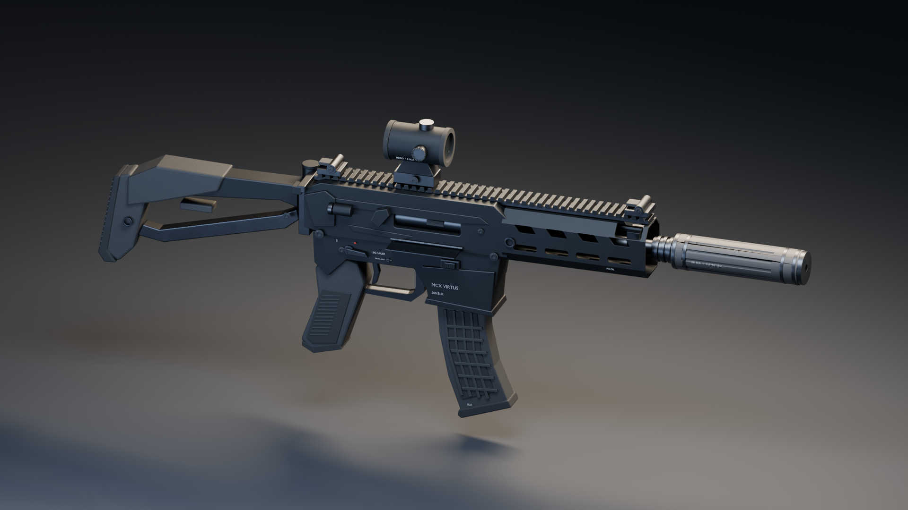

# MCX VIRTUS / .300 BLK

Standalone, Blender-authored visual interpretation of the black MCX VIRTUS:
short handguard, 9-inch-barrel configuration, generic suppressor, folding /
telescoping-style stock, compact optic and curved .300 magazine.



## Open these

- **`mcx-virtus.blend`** — editable components, bevel modifiers, rigid-part rig,
  six synchronized NLA clips, packed textures and five lit studio cameras.
  Start with the **START HERE** text block. Authored/tested in Blender 5.2.
- **`mcx-virtus.glb`** — standalone, textured and animated glTF 2.0 asset. All
  images are embedded; no external URLs, add-ons or runtime dependencies.
- **[`renders/animation-reel.mp4`](renders/animation-reel.mp4)** — all six clips;
  firing/ejection shown at half speed, other clips at normal speed. No audio.
- **`renders/`** — hero, right/left profiles, receiver detail and rear/first-person
  study. These are Blender studio renders, **not screenshots of the game**.
- **`textures/`** — 1024² tileable surface variation, roughness and tangent-space
  +Y micro-normal PNGs. Shader color/roughness factors differentiate alloy,
  steel, polymer, rubber, ceramic, brass, copper, markings and optical glass.
- **`manifest.json`** — exact mesh counts, clip lengths and event timings.

The asset is deliberately **not integrated into the playable game**. Normal
`npm run models` / `npm run build` does not rebuild or package it. It remains
under `assets/`, away from the game's generated `public/models/weapons/`.

## Animation

| Clip | Duration | Motion |
|---|---:|---|
| `Idle` | 2.0 s | Subtle breathing, seamless loop |
| `Fire` | 0.8 s | Trigger, recoil, bolt cycle, spinning spent casing arc |
| `Reload_Tactical` | 2.6 s | Weapon cant, retained-magazine departure, fresh magazine insertion |
| `Reload_Empty` | 3.3 s | Locked-back bolt, magazine exchange, charging-handle pull and bolt return |
| `Inspect` | 4.0 s | Tilt, hold and roll to examine the receiver and top rail |
| `Stock_Fold` | 2.0 s | Fold left, hold, unfold |

Animations are **weapon/part animations, not a character performance**. No
hands, arms, hand IK, audio, muzzle flash or smoke are supplied. Grip sockets
are provided for a later character rig. Reload magazine handoffs occur below
the weapon; a hand rig would conceal the off-screen mesh substitution.

Blender uses 60 fps. Each clip has matching NLA-track names on all ten moving
rig objects; enable the same track on **every** object, not just `MCX_RIG`.
`Idle` is already selected when opening the source. The helper below selects
tracks consistently and can render an arbitrary pose:

```bash
blender -b assets/weapons/mcx-virtus/mcx-virtus.blend \
  --python tools/blender/mcx_review.py -- \
  --clip Fire --frame 8 --camera receiver_detail

# Re-render the complete 24 fps video; requires ffmpeg with libx264/drawtext.
blender -b assets/weapons/mcx-virtus/mcx-virtus.blend \
  --python tools/blender/mcx_review.py -- --reel
```

To preview interactively, omit `-b` and add `--select-only` after `--`.
Then press Space. The helper does not save changes to the source file.

### glTF / Three.js handoff

- Metres; Blender +X forward / +Z up; glTF +X forward / +Y up.
- Right-side casing ejection is Blender −Y / glTF +Z.
- Static geometry is merged under rigid pivots; no armature or skin weights
  are necessary for these mechanical animations. The source retains named
  individual components. This is a first-person asset, not a world-weapon LOD.
- Named empties: `SOCKET_muzzle`, `SOCKET_ejection`, `SOCKET_grip_R`,
  `SOCKET_grip_L`, `SOCKET_magazine`, `SOCKET_sight`.
- Two magazine meshes swap using stepped zero/unit scale (no sub-frame
  shrinking). The generator preserves STEP interpolation after Blender's NLA
  export, which otherwise converts changing scale to LINEAR. Scale-zero objects
  still incur submissions in Three.js unless a host additionally culls them.
- `Fire` contains **one** baked casing. Its 0.8 s duration includes the flight,
  not a prescribed fire rate. For automatic fire / multiple simultaneous
  casings, detach or replace this with a pooled emitter at `SOCKET_ejection`.
- Optical lenses use `KHR_materials_transmission` and `KHR_materials_clearcoat`.
  A collimated red-dot reticle is **not** included. Transmission needs renderer
  support and can add a render pass; substitute a cheaper lens for world LODs.
- Play `Idle` in a loop. Other clips are one-shots: `LoopOnce`,
  `clampWhenFinished = true`, then transition to `Idle`. Avoid blending two
  reloads, since visibility is encoded in scale. Every clip exports all 30
  rig TRS channels, including constant reset channels.
- These clips describe visual motion only. `manifest.json` timings are a
  handoff reference, not an implementation of the game's event contract.

## Rebuild

Run from the repository root, with Blender's bundled Python/NumPy:

```bash
blender -b --python tools/blender/mcx_virtus.py
# Include five full-size studio stills:
blender -b --python tools/blender/mcx_virtus.py -- --render
# Faster draft stills:
blender -b --python tools/blender/mcx_virtus.py -- --render --quick
node tools/smoke-mcx.mjs
```

The generator uses a fixed seed and no downloaded content. It overwrites this
asset's `.blend`, GLB, manifest and texture files; it does not touch game code
or world assets. It is reproducible authoring, not a promise of byte-identical
Blender exports between different Blender versions.

A working **AgX OpenColorIO configuration** is required. The local distro
Blender 5.2 package used during authoring shipped a 2.5 OCIO config with a 2.4
OCIO library, so it required the compatible Blender 4.5.3 color configuration
via `OCIO=/path/to/config.ocio` (and its LUTs). This is an installation issue,
not an asset dependency; a correctly packaged Blender needs no override.

## Quality / scope

Beveled silhouette geometry, actual hollow handguard vents, receiver port,
separate controls, moulded grip and magazine ribs, recessed fasteners, subtle
surface variation, readable markings and a modeled open-neck spent casing.
The material microdetail is tileable, not a unique hand-painted wear/AO atlas.
No LODs, collision mesh or engine-specific optimization are supplied. The
studio presentation is a high-detail art pass; final AAA acceptance, hand
animation and in-engine lighting/reticle polish still require art direction.
This is not a dimensionally exact replica or manufacturing geometry.

### Visual references

Reference images were consulted, not redistributed or embedded:

- [Bauer Precision VIRTUS .300 BLK product photos](https://www.bauer-precision.com/sig-sauer-mcx-virtus-300-blackout-pistol-9-chf-cl-barrel-black/)
- [SIG folding / telescoping stock](https://www.sigsauer.com/sig-sauer-telescoping-folding-stock-mcx-mpx-fde.html)

Original modeled geometry and generated textures; no third-party model or
texture assets. SIG SAUER / MCX / VIRTUS names identify the subject. This asset
is not licensed, endorsed or approved by SIG SAUER; commercial use of branding
may need separate review.
