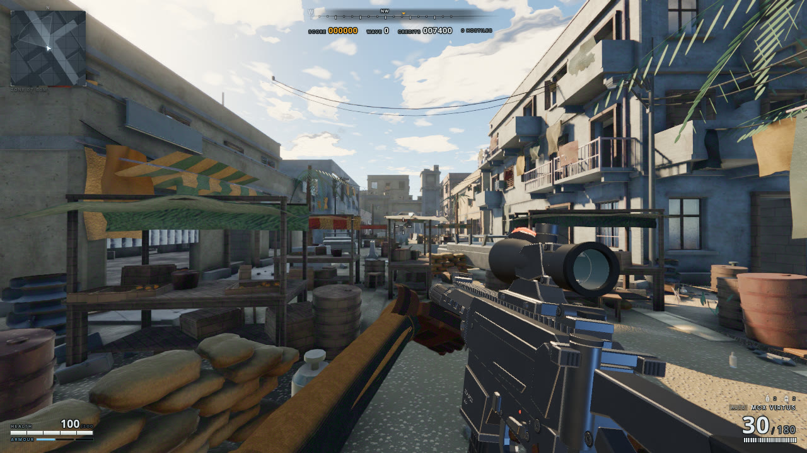
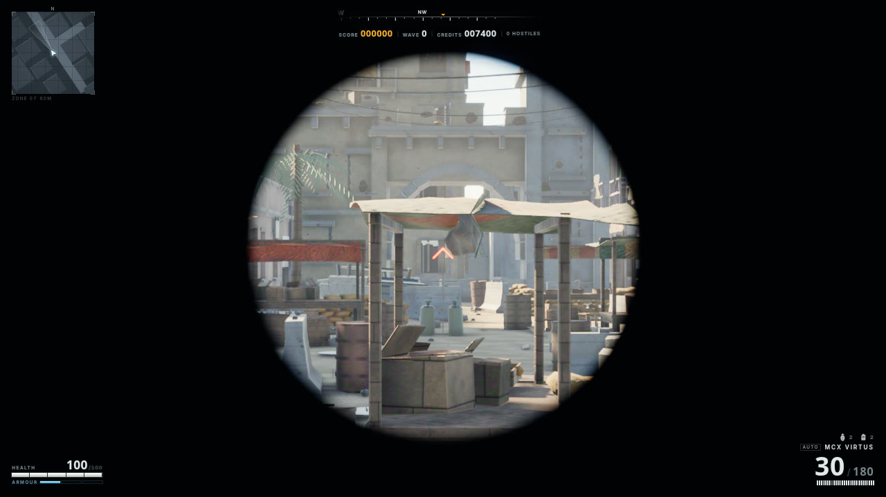

# MCX VIRTUS in game

Buy **MCX VIRTUS — 1100 credits** in the supply market (primary slot, key **7**).
It replaces your equipped primary, not the M4A1 definition. The M4 remains the
starting rifle and can be bought back. SMG/shotgun and pistol slots are unchanged.
The tenth shop item, carpet bomb, uses **0**.

## Controls and handling

| Input/state | Animation / behavior |
|---|---|
| At rest | Looping `Idle`, plus shared movement/sway |
| LMB | `Fire`: trigger, recoil, bolt; independent pooled .300 brass |
| RMB | ACOG-style 4x sight picture with red chevron and stadia |
| B | Auto / semi-auto |
| R with a chambered round | `Reload_Tactical`, 2.6 s |
| R with an empty chamber | `Reload_Empty`, 3.3 s; charging handle / bolt return |
| I | `Inspect`, 4.0 s; firing cancels it |
| 1 / 2 / 3 | Primary / secondary / pistol; shared draw and holster |

The stock stays extended; folding is not available in gameplay. The existing IK
arms follow the animated weapon, magazines and handle. Reload ammo/foley beats
use the source manifest; cancel/switch/death restore one seated magazine and the
resting parts. The existing chambered-round
rules apply: tactical reload retains its chambered round; empty reload feeds one
from the new magazine.

Game load: suppressed subsonic .300 BLK, 305 m/s, 800 rpm, 30-round magazine,
180 reserve, no visible tracer. Damage/recoil/economy are gameplay tuning, not
manufacturer specifications. All values live in `src/weapons/defs.js` / market data.

## Sound

**[Listen: single shot, 800 rpm burst, synthesis fallback](sound-preview.wav)**

Two short, locally bundled reports derived from existing **CC0 Savage 10 .300
Blackout recordings**, plus dedicated pressure/body and piston-action synthesis.
This is a **designed MCX game sound, not an authentic MCX field recording**.
No M4 buffer-spring twang or revolver-cock layer; seeded pitch/level variation,
round-robin takes, suppressed muzzle signature and the existing spatial mix.
See [recording provenance and edits](../../../../src/audio/samples/LICENSE.md).
The preview is dry (without scene reverb); its final shot exercises missing-sample
fallback. Peak is approximately -5.8 dBFS without clipping.

## Implementation / validation

- `src/weapons/mcx.js`: loads the committed GLB through Vite, converts +X to -Z
  forward and adapts five clips to the shared viewmodel. Live fire retimes the
  mechanical clip 2.5x so the carrier returns before the next 75 ms shot. The
  single showcase casing is hidden; ejection uses the live socket and FX pool.
- Packed PBR maps remain intact. Coatings are calibrated for the game's brighter
  viewmodel lighting; thin alpha lenses disable the expensive transmission pass.
  ACOG aiming uses the existing full-screen scope path, not picture-in-picture.
- No new dependencies, external URLs at runtime, Blender build step, world-asset
  changes, new player inventory slots, world-weapon LODs or collision meshes.
- `npm test`: real GLB sampler/adapter checks, cadence, ammunition, interruption,
  switching, death/reset, scope and audio contracts; existing M4/other gun tests.
- `node tools/check-mcx-game.mjs`: real shop hotkeys, actual ADS camera zoom,
  16:9/4:3 scope aspect, gameplay captures, one shell/shot and WebAudio preview.
  Writes evidence to `.tmp-rend/mcx-game/`; requires a browser/GPU, not Blender.
- `node tools/mcx-audio.mjs`: deterministically rebuilds both reports offline.
- `npm run build` and `node tools/capture.mjs` cover the normal asset/boot path.

The `.blend` and source GLB are unchanged. Screenshots here are from the playable
game, not the Blender studio. Final art/handling/audio acceptance remains a human
review; this is not a manufacturing-accurate model or ballistics reference.
