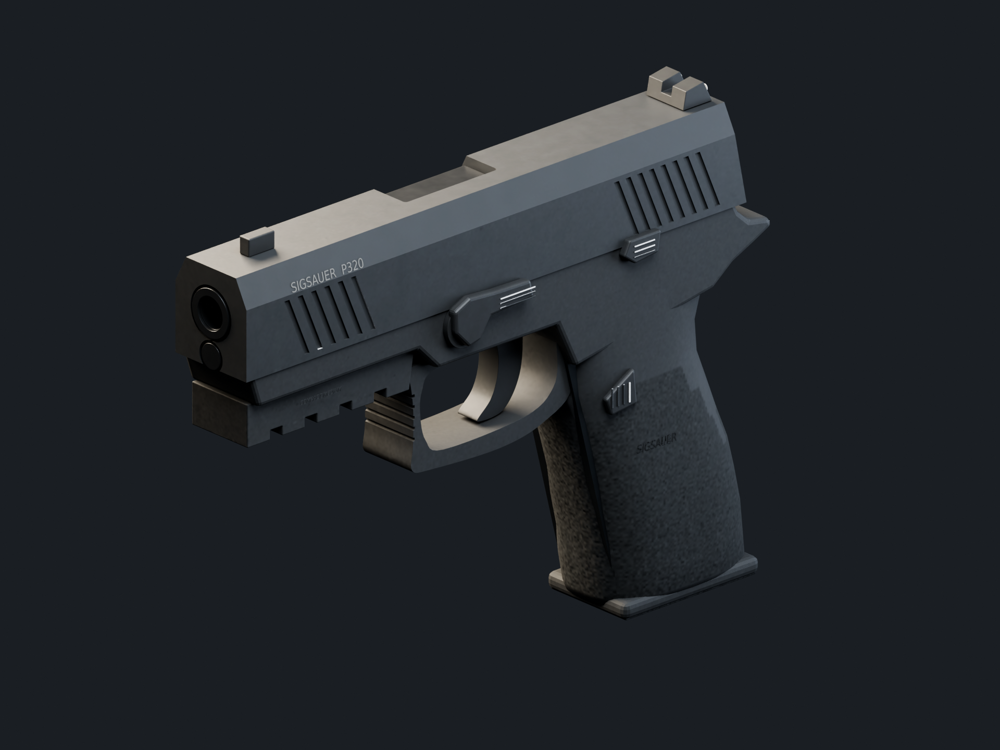
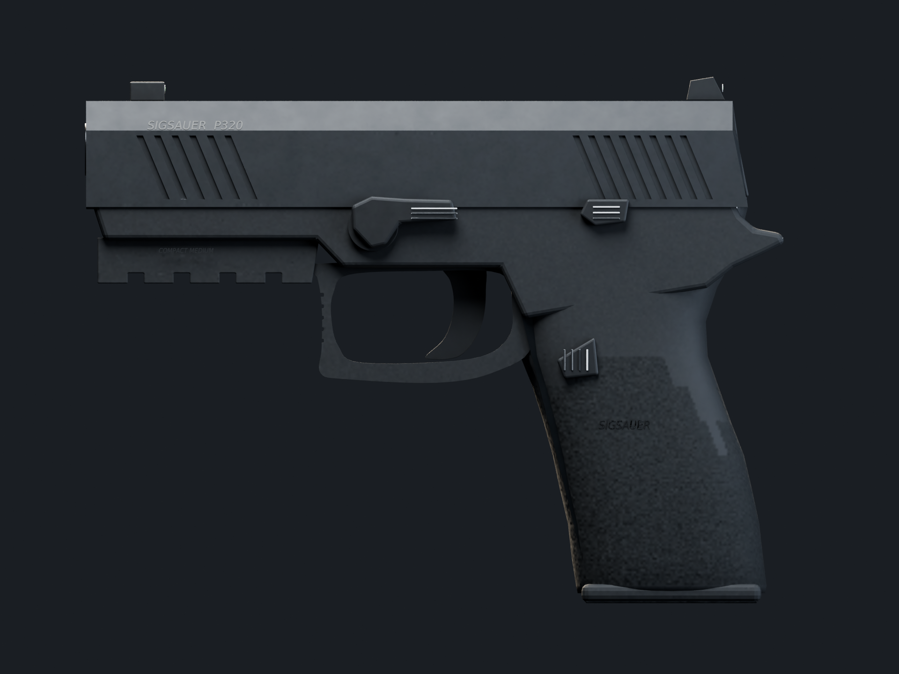

# P320 Compact

Playable replacement for `pistol`: early-production SIG P320 Nitron Compact,
medium compact grip, curved trigger, SIGLITE irons and flush 15-round magazine.
Original non-functional game art. No downloaded meshes/textures or new runtime
dependencies. Not endorsed by SIG SAUER.



## Review

- [Animation reel — eight actions, authored hands](renders/animation-reel.mp4)
  (silent Blender render; firing actions slowed to 20%, other actions real time).
- Native **2560×1440, high, DPR 1**: [before](gameplay/before.png),
  [hip](gameplay/hip.png), [ADS](gameplay/ads.png),
  [inspect left](gameplay/inspect-left.png), [inspect right](gameplay/inspect-right.png),
  [tactical reload](gameplay/reload-tactical.png), [empty reload](gameplay/reload-empty.png),
  [fire](gameplay/fire.png), [lockback](gameplay/lockback.png).
- Unscaled game crops: [hip detail](gameplay/hip-detail.png), [sights](gameplay/sight-detail.png).
- Studio: [left](renders/left-profile.png), [right](renders/right-profile.png),
  [rear/sights](renders/rear-detail.png), [authored hands](renders/authored-hands.png).
- [Reference board and attributions](REFERENCES.md) · [approved brief](BRIEF.md).

| Primary photographic silhouette (perspective) | Authored studio profile (orthographic) |
| --- | --- |
|  |  |

Different cameras/exposure are intentional: this is a visual comparison, not a
calibrated overlay. Third-party photographs stay linked to their publishers.

## Source and runtime

- `p320-compact.blend`: named editable components, shared glove/sleeve skins,
  two posed armatures, wrist/finger controls, eight synchronized NLA tracks,
  packed 1024² base/ORM/normal atlas and five review cameras.
- `p320-compact.glb`: self-contained weapon, sockets and animation controls.
  Hands are animated in Blender but reuse the existing runtime skins rather than
  shipping duplicate arms/textures. Shoulder/elbow IK, locomotion, sway and ADS
  remain runtime layers. The same wrist/finger curves drive Blender and the game.
- `manifest.json`: measured export counts, clip durations and mechanical events.
- `hand-reference.json`: offline contact seeds, not a runtime contact solver.
- `src/weapons/p320.js`: loader, local material calibration, authored curve
  sampling, persistent lockback, hand application and resource disposal.

Wrist/finger control actions are the runtime source of truth; the two native
armatures contain matching baked preview actions. Manual animation edits must
keep those representations synchronized. The source checker detects divergent
wrists; regenerating from the authoring scripts overwrites manual source edits.

The normal build uses the committed GLB; **Blender is not needed to play/build**.
The old procedural P-19 builder remains only for regression comparisons; it is
not loaded by gameplay, the weapon preview or the procedural exporter.

### Action timing

| Action | Duration | Important beats |
| --- | ---: | --- |
| Idle | 2.00 s loop | subtle authored breathing, runtime movement retained |
| Fire | 0.20 s | casing at 0.033 s; slide returns before next legal shot |
| Last shot | 0.20 s | persistent open slide after action ends |
| Tactical reload | 2.40 s | retain old magazine; out 0.467 s, insert 1.717 s |
| Empty reload | 2.70 s | drop old magazine; insert 1.717 s, slide catch 2.150 s |
| Inspect | 3.30 s | indexed trigger finger; no ammunition change |
| Draw | 0.50 s | authored weapon/wrist/finger arrival |
| Holster | 0.40 s | coordinated departure |

The retained magazine is carried below frame before the fresh one appears.
Magazine visibility is discrete, not a shrinking mesh. The displayed cartridge
is hidden in an empty departing magazine. Finger and wrist channels are consumed
directly, not replaced by procedural grasp poses during weapon actions.

Capacity/reserve are **15/60**; damage **28** and cadence **460 rpm** are unchanged.
The existing separate-chamber contract remains: tactical reload can leave 15+1;
an empty reload feeds one of the 15 into the chamber. Existing HUD semantics remain.

Audio uses the existing procedural noise/resonator bank. P320-only behavior:
retained magazines omit the ground-impact sound; the slide clack occurs at the
authored catch-release beat; reload end is a grip rustle, not a fictitious rack.
Other weapon sounds, shared arm appearance and global lighting are unchanged.

## Measured cost and acceptance caveat

[Raw three-run report](gameplay/report.json): RX 9070 XT, Chromium/ANGLE Vulkan,
2560×1440/high, fixed scene, 90 warmup frames then 3×120 samples per weapon.
GPU timings cover the viewmodel forward pass **including the shared arms**;
geometry/submission/texture counts below cover the weapon only.

| Metric | Old P-19 | MCX | P320 |
| --- | ---: | ---: | ---: |
| Visible weapon triangles, idle | 25,480 | 86,540 | 50,062 |
| Visible weapon primitives | 18 | 29 | 13 |
| Estimated unique RGBA8 texture storage incl. mips | 48 MiB | 16 MiB | 16 MiB |
| Viewmodel GPU p50, range across runs | 0.215–0.216 ms | 0.259–0.261 ms | 0.185–0.188 ms |
| Viewmodel GPU p95, range across runs | 0.227–0.352 ms | 0.273–0.344 ms | 0.197–0.201 ms |
| Lockstep wall-frame p50 | 3.1–3.4 ms | 3.1–3.5 ms | 2.9–3.0 ms |
| Lockstep wall-frame p95 | 41.2–44.5 ms | 42.5–44.0 ms | **48.7–50.0 ms** |
| Maximum observed wall sample | 101.8 ms | 116.7 ms | 114.7 ms |
| Post-warmup shader compilations | 0 | 0 | 0 |

The complete export has 50,062 triangles, 7 unique meshes, 13 primitives and
3 images. MCX's complete export is 93,606 triangles; its hidden pieces explain
the smaller visible count above. Texture memory is an estimate, not driver VRAM
telemetry. Unavailable timer results are excluded; valid sample counts are in JSON.

**The weapon GPU/geometry/texture measurements meet the provisional MCX ceiling,
but the full-frame wall-time tail does not.** The capture samples include browser
scheduling, world rendering and GPU queue stalls; they are not combat FPS, and
this run does not isolate the cause of the worse P320 p95. This is an explicit
review/approval item, not a claimed clean full-frame performance pass. No detail
was silently removed to mask it and no fixed FPS is promised.

## Validation

- `npm test`: 45 smoke tests passed.
- `npm run lint` and `npm run build`: passed.
- `node tools/capture.mjs --out=.tmp-rend/p320-default.png`: `ok: true`.
- No world/prop assets changed, so world regeneration/validation was not needed.
- P320-specific checks: offline GLB/atlas integrity and budgets; authored channels;
  non-collapsed meshes; discrete magazine visibility; magazine/wrist contact
  within 2 mm throughout fractional reload samples; chamber/reserve accounting;
  fire cadence/casing count; empty lockback; inspect cancellation; switching;
  reload interruption/death/reset; audio event metadata; resource cleanup.
- Shared grip and ADS/zero regression tests use the actual P320 GLB.
- Blender-source checker: native skin wrists agree with exported control wrists
  within 0.0002 mm at sampled frames; packed atlases and finite bone transforms.
- Browser review covers hip/ADS, rapid fire, both reloads, inspect cancellation,
  lockback, weapon switching and return from bandage/grenade/radio poses.
- Offline WebAudio checks cover retained/dropped magazine, slide and grip-settle
  voices: finite, non-silent, unclipped output. See [checks.json](gameplay/checks.json).

No pre-existing smoke test was deleted or relaxed. The new visibility test uses
1e-5 tolerance around zero/unit scale because glTF float32 matrix decomposition
perturbs exact unit values; intermediate/shrinking scales still fail.

## Reproduce

From the repository root, with Node dependencies installed and Blender 5.2:

```sh
node tools/p320-hand-reference.mjs
blender -b --python-exit-code 1 --python tools/blender/p320_compact.py -- --render
blender -b assets/weapons/p320-compact/p320-compact.blend --python-exit-code 1 --python tools/blender/p320_check.py
blender -b assets/weapons/p320-compact/p320-compact.blend --python-exit-code 1 --python tools/blender/p320_review.py -- --reel
node tools/check-p320-game.mjs --frames=120
npm test
npm run lint
npm run build
node tools/capture.mjs
```

`--no-bake` is for animation-only iterations with unchanged geometry/UVs.
`p320_review.py --hands --clip Reload_Empty --frame 126 --camera first-person`
renders a saved-source pose without reconstructing the asset. FFmpeg with
libx264/drawtext is needed only for the reel. Use a Blender-compatible OCIO
configuration; this machine required an explicit `OCIO` path because its system
Blender/OCIO packages were mismatched. Optional source font: DejaVu Sans Condensed
Oblique; saved/exported lettering is geometry and needs no runtime font.

## Remaining limits

This is a photographic visual reconstruction, not manufacturing geometry or a
scan. Underside/magwell and small sight details are less constrained than the side
profiles; motions are original game animation, not a traced live-action take.
The reel is a Blender review, not a gameplay video or audio demonstration.
Visual superiority over MCX and final reference fidelity require human review;
these screenshots/tests do not certify photographic identity. The full-frame
performance-tail caveat above also requires acceptance before merge.
