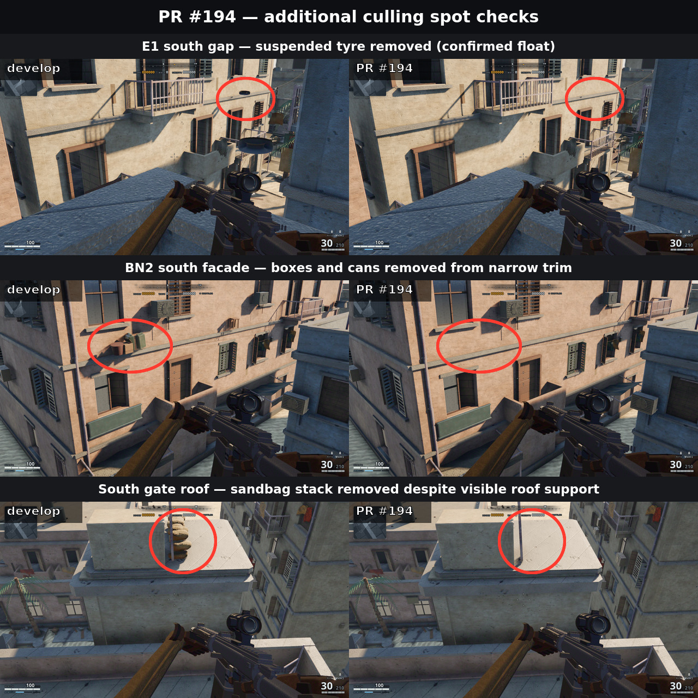

# Extra floats the new oracle caught

The telemetry dump had five marks. The support check currently culls **155** furniture instances and removes **20** associated dust skirts. No extra door/counter collisions besides W2 (the original mark).

These five shots are from `develop` (objects still present) so you can confirm they were real.

| Shot | Objects | Gap |
|---|---|---|
| [01](01-e3-roof-edge.jpg) | `stool/0025`, `planter/0025`, jerry cans off E3 | ~6.8 m |
| [02](02-west-water-tanks.jpg) | `water_tank/0010`, `water_tank/0011` south of W4 | ~6.6 m |
| [03](03-north-roof-stool.jpg) | `stool/0031` off the NE roof | ~6.6 m |
| [04](04-nw-terrace-planter.jpg) | `planter/0028` off W5 at terrace height | ~3.5 m |
| [05](05-e2-stool-crate.jpg) | `stool/0020` and a crate off E2 | ~6.6 m |

Same class as the rooftop telemetry marks: origin outside `roofSpec` / terrace, so the street is the only support, 3–7 m below.

## Follow-up spot checks

The E1 tyre is a confirmed float. The wider sampling also found that the BN2 facade clutter appears authored on narrow trim and the south-gate sandbag stack is visibly roof-supported. Those latter cases remain false positives in the current cull and need follow-up.
