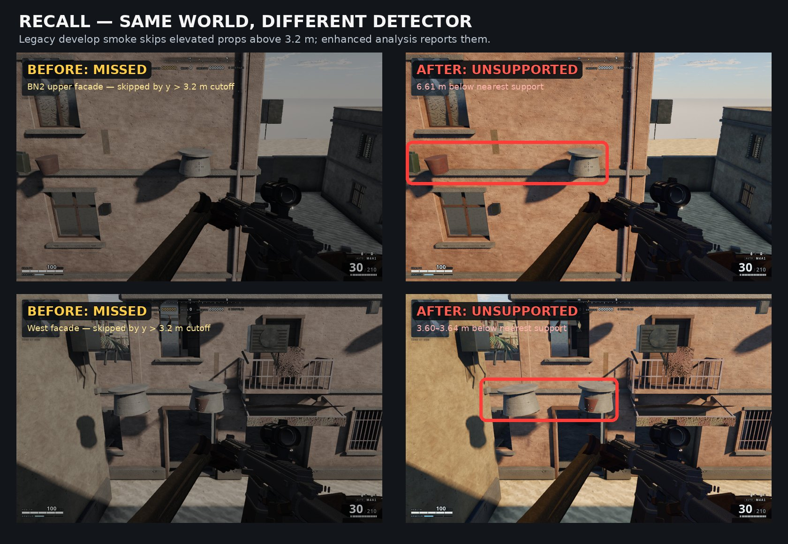
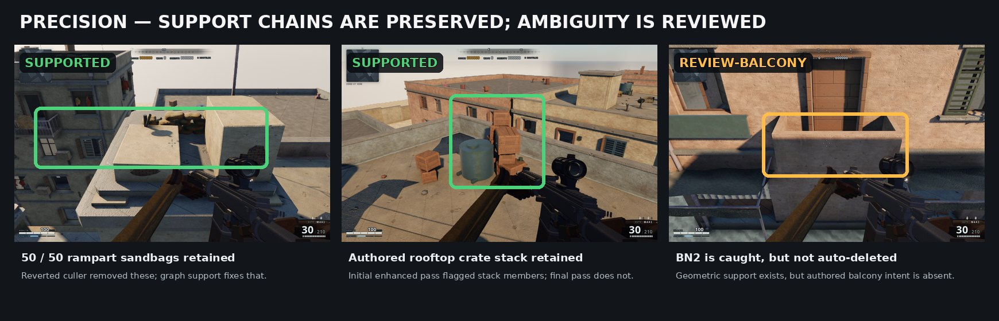

# PR #196 evidence

The analyzer is report-only, so the world geometry is intentionally identical in the before/after panels. The visible difference is the detector verdict shown over the same scene.

## Recall improvement

The legacy `smoke-floating-props.mjs` skipped ordinary candidates when `position.y > 3.2` and skipped indoor candidates. Consequently:

- all **45** current high-confidence unsupported detections are above 3.2 m (range 3.582–6.650 m) and were unreachable to the legacy sweep;
- six of seven re-injected PR #194 fixtures were also above 3.2 m;
- the seventh fixture was inside W2 and was skipped by the outdoor-only path.

The enhanced analyzer detects all seven fixtures and exposes the 45 current unsupported placements. The screenshots show sampled results: props visibly perched on decorative facade bands at BN2 and on the west side.

## Precision improvement

The reverted PR #194 culler put at least 50 intentionally generated gate sandbags in its removal set. The first enhanced-analysis iteration also reported valid crate and tyre stack members because vertical rays did not model support chains or interlocking geometry.

After iteration:

- all **50/50** generated high rampart sandbags are supported;
- the representative rooftop crate and tyre stacks are supported through their dependency chains;
- the W2 stair chair, shelf goods, and known roof tank remain supported;
- BN2 is not silently accepted: its physical balcony contact is separated into `review-balcony` because no authored balcony intent is declared.

## Current confusion matrix

| Set | Expected | Result |
|---|---:|---:|
| Re-injected confirmed floats | 7 unsupported | 7 unsupported |
| Generated high rampart sandbags | 50 supported | 50 supported |
| Representative known-valid placements | 5 supported | 5 supported |
| BN2 shown cluster | 4 review | 4 `review-balcony` |
| Sampled elevated facade errors | 3 unsupported IDs | 3 unsupported |

The remaining 52 balcony, 9 overhang, and 4 small-gap results are explicitly review categories, not automatic failures. No placement is deleted by this PR.
