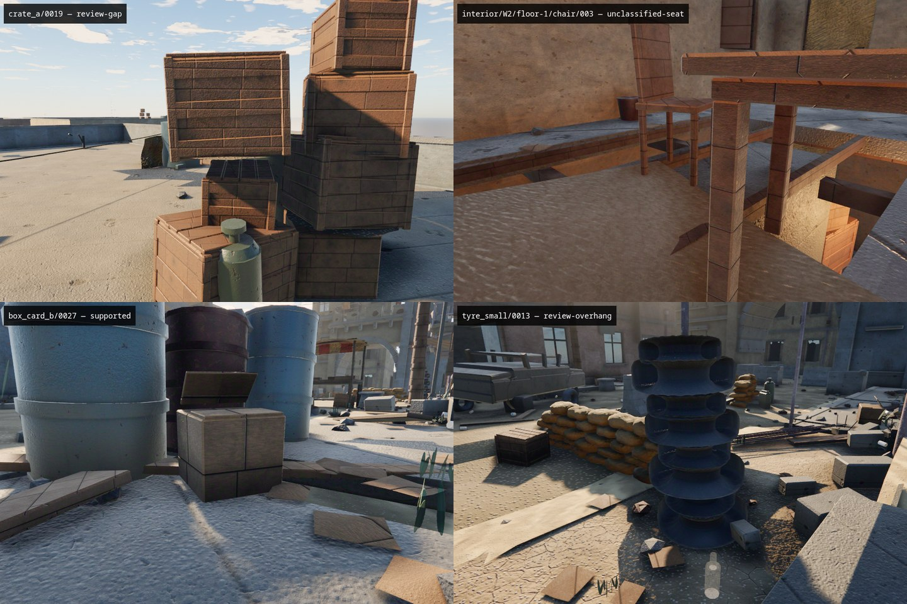
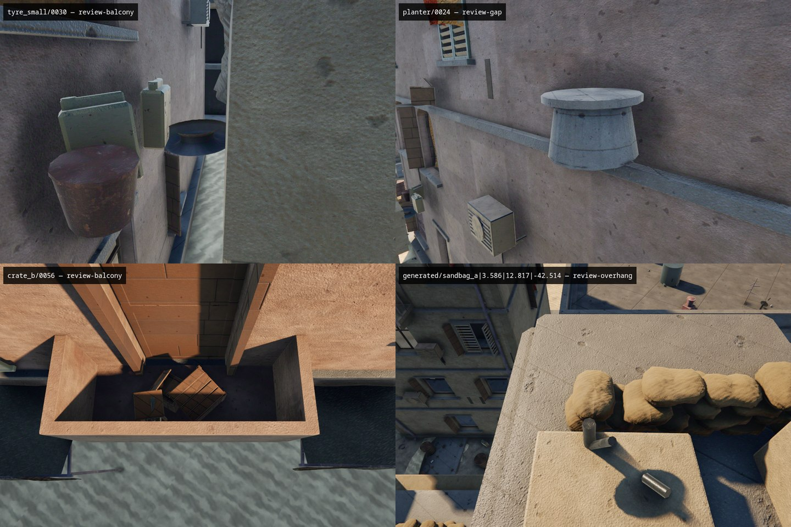

# Decision-logic replacement: review against c1a2132

The world is unchanged. This replaces the decision logic of PR #196, retains
its spatial index/authoring integration, and regenerates only the source
fingerprint in `level.json`. No placement was moved or deleted.

## Full comparison

Both detectors examined the same **3,837 current props + 7 probe fixtures**.
The complete changed-candidate inventory is in
[`decision-comparison.json`](decision-comparison.json), including positions,
old/new verdicts, reasons, local versus inherited concerns, nearest surfaces
and stability margins. No candidates were added or lost.

| Current-world verdict | Old | New |
|---|---:|---:|
| supported | 3727 | 3375 |
| unsupported | 45 | 42 |
| review-balcony | 52 | 52 |
| review-overhang | 9 | 192 |
| review-gap | 4 | 111 |
| unclassified-seat | 0 | 60 |
| review-penetration | 0 | 5 |

- **353 newly flagged:** 104 gap, 189 overhang, 55 unclassified-seat and 5
  penetration. These are review results, not 353 visually confirmed defects.
- **1 cleared:** `box_card_b/0027`, formerly `review-overhang`, now supported.
- **10 reclassified** within the old suspicious set, including three formerly
  unsupported objects described below.
- **42/45** previously unsupported props remain unsupported; the other three
  still require review. **None of those 45 is silently accepted.**
- **7/7** removed-float fixtures remain unsupported.
- **82** current warnings have only inherited uncertainty; inspect their named
  supporters before treating them as separate defects.

The larger queue deliberately exposes what broad tolerances and the stack
shortcuts previously accepted. It is not a precision/recall score. The current
world does not have a complete independently labelled ground-truth set.

## Spot checks

Fixed-camera screenshots were inspected in the running game, with HUD and
viewmodel hidden. Poses are committed in `decision-spot-checks.json` and can be
reproduced with `node tools/capture-support-review.mjs --report=<full-report>`.
The contact sheets are in the same order as the tables below.

### Newly flagged and cleared

| Placement | Old → new | Review finding |
|---|---|---|
| `crate_a/0019` | supported → review-gap | Visible air under the upper rooftop crate. New closest gap 8.04 cm; independent mesh rays find 8.12 cm and zero contacts. The old crate-overlap exception hid this. |
| `interior/W2/floor-1/chair/003` | supported → unclassified-seat | Two feet are **10 cm above the stair**. The other two touch/intersect an unclassified fabric surface. Calling the whole chair stably supported was incorrect. |
| `box_card_b/0027` | review-overhang → supported | The box visibly sits on the pavement. Denser real-face samples surround its estimated centre; independent rays confirm contact. The old nine-bin/percentage test was too coarse. |
| `tyre_small/0013` | supported → review-overhang | The top tyre has a valid local contact footprint, but inherits uncertainty from lower tyres/base. The base's independent rays have a 2.96 cm minimum and 5.32 cm median gap to ground. This is an intentional pile, **not a confirmed floating top tyre**; keep it in stability review. |

### Reclassified and retained review

| Placement | Old → new | Review finding |
|---|---|---|
| `tyre_small/0030` | unsupported → review-balcony | Lower-envelope sampling plus winding correction finds actual balcony contact (nearest sample 1.90 cm). It remains composition/stability review, not supported. |
| `planter/0024` | unsupported → review-gap | Still visibly misplaced on a facade. A narrow unclassified ledge is about 17 cm below part of its footprint; independent rays find 17.22 cm. The old sampler missed that ledge. This is a severity correction, not a cleared placement. |
| `crate_b/0056` / BN2 | review-balcony → review-balcony | The cluster is physically seated behind the balcony parapet, with no declared balcony intent. The four original BN2 IDs all remain in this queue. |
| generated rampart bag at `(3.586, 12.817, -42.514)` | supported → review-overhang | Actual contact exists, but the estimated centre lies 8.77 cm outside the sampled contact hull. This is intentionally authored soft/interlocking geometry; the detector does not simulate deformation/friction, so it conservatively declines to certify stability. |

The remaining formerly unsupported reclassification is `jerry_can/0015`:
`review-gap`, with its nearest rooted prop (`tyre_small/0030`) about 7 cm below
its underside. It also retains balcony/chain uncertainty. It was inspected in
the same narrow facade cluster, not counted as a new valid placement.

Independent geometric spot checks used Three.js `Raycaster`, not the spatial
hash's barycentric query: upward rays against the subject find its underside,
then downward rays find outward/upward static or solid-instance faces. They
exclude the subject and decorative instances, and correct closed-prop winding.
A separate 16×16 grid was used, except for the chair's four authored foot
centres. These checks validate geometry, **not** the rooted stability solution.
Raw measurements are in [`decision-ray-checks.json`](decision-ray-checks.json).

## Iteration and adjustments

1. The first replacement pass produced 604 suspicious results. Inspection
   showed that treating every high underside ray as a gap incorrectly penalized
   ordinary chair seats and curved surfaces. Contact evidence now takes
   precedence over those natural air gaps.
2. The actual tyre meshes have **reversed winding**: their geometric bottom
   triangles point upward and their top triangles point downward. Signed-volume
   correction fixes both contact sampling and instance support indexing. This
   replaces the former tyre proximity exception with measured contact, including
   negative-scale handling. A post passing through a tyre hole still fails.
3. Thin-face fallback points now survive when a nearby grid ray hits a higher
   underside. Uniform-density volume centres replace AABB centres; malformed
   estimates fall back to the geometry bounds centre.
4. Contact tolerance is 4 cm, matching the pre-PR ground-test modelling budget,
   not the PR's 18 cm general tolerance / 25 cm crate exception. Larger gaps and
   deep intersections stay diagnostic rather than certifying support.
5. Every analyzed solid can carry another; planks/bricks are no longer silently
   excluded from support evidence. Decorative skirts/litter still cannot carry
   a stack. Generated candidates are included in the default review output.

The final queue has 462 entries. No prototype-specific contact thresholds or
proximity/overlap exemptions were introduced to make selected examples pass.

## Tests and deliberately corrected expectations

`smoke-support-geometry.mjs` adds **28 independent checks**, covering grounded
stacks, detached cycles, coordinate transforms, gap sweeps, a 24 cm crate gap,
a 15 cm stool gap, a 22 cm stool/table gap with correct nearest owner, disjoint
sandbags, reversed-winding tyres, torus holes, raised feet on steps, tilted
one-corner seating, negative/non-uniform scale, tessellation, clean alternative
support, and inherited gap/overhang/balcony/unclassified uncertainty.

The world smoke now covers **all 45** old unsupported placements, not only
three representatives. Existing removed-placement and alley-ground regressions
remain. Existing roof-tank, shelf-good and representative seated-crate positives
remain supported, and the newly cleared box is a positive regression fixture.

Two previous expectations were wrong or overconfident:

- The W2 chair and top tyre previously had to equal `supported`. They now must
  retain **measured contact**, with the specific review reason described above.
  The top tyre must still have a stable *local* footprint.
- The rampart test previously demanded at least 40 all-supported sandbags. It
  now requires **exactly 50**, all with measured contact: **48 supported and two
  specific overhang reviews**. The second review is at
  `(-0.024, 7.172, -42.366)`, with an 8.59 cm negative footprint margin. These
  valid authored soft piles are a known conservative-review limitation, not
  justification for restoring fake contact coverage.

No smoke test was deleted, and no placement data was changed to pass tests.

## Validation

- `npm test`: **16/16 smoke scripts**, including the 28 geometry checks.
- `npm run lint`, `npm run build`, `npm run world:validate`: pass.
- `npm run world -- --check`: byte-identical to regenerated committed assets.
- `node tools/capture.mjs`: game boots and produces a frame.
- Eight fixed-pose review captures plus six independent geometric ray checks.

## Remaining uncertainty

Side bracing, friction, deformable sandbags, open/mixed-winding meshes and tiny
features remain outside a complete physical model. A local contact hull is not
a loaded-stack centre-of-mass simulation. Missing authoring tags create review,
and a misplaced object fully seated on a declared roof can still pass. The
additional debris/pile warnings have **not all been visually adjudicated**.
Keep the tool report-only; use physical evidence and root causes to triage,
not the suspicious count as an accuracy claim or an automatic cull list.
