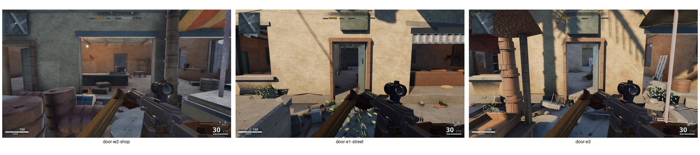
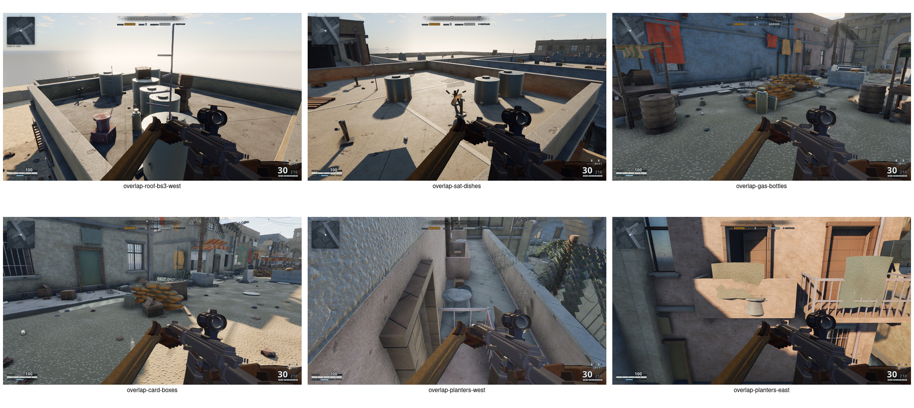
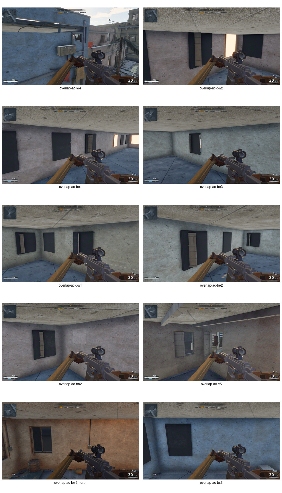

# World map collision audit and fix plan

## Verdict

Both claims are valid, with one qualification:

1. **Standing door traversal is broken on two visibly open entrances:** E1's street door and E3's street door. A standing capsule stops at the lintel; the crouched capsule passes. W2's open shopfront passes while standing and is the control case. Closed decorative door leaves were not counted as traversal defects.
2. **There are 16 confirmed accidental prop-overlap clusters (36 authored prop instances).** The audit also found many intentional contacts—goods on stalls, debris in wrecks, stacked tyres/sandbags—which are not defects and should not be separated.

This is an audit/plan only. No game or world source has been changed.

## Evidence and method

- Built the authored world and inspected all **8,139 instances**.
- Broad-phase AABB scan produced **1,101 candidates**. Because AABBs over-report rotated and intentionally nested props, I rendered and reviewed every candidate above `0.20 m³`, plus same-prototype near-duplicates.
- Tested doorway traversal against the shipped static collision with the real `0.32 m`-radius character controller at standing (`1.78 m`) and crouched (`1.12 m`) heights.
- Excluded micro-rubble, foliage, stall merchandise, wreck debris, and deliberate stacks unless two stable authored instances visibly occupy the same volume.

### Door evidence



| Opening | Standing result | Crouched result | Finding |
|---|---:|---:|---|
| W2 open shopfront | Pass | Pass | Control; no change needed |
| E1 street door | Stops after ~`1.02 m` | Passes `2.48–3.00 m` | Confirmed |
| E3 street door | Stops after ~`0.89 m` | Passes `2.66–3.07 m` | Confirmed |

**Root cause:** ground-floor door holes end at `2.16 m`, while the solid building plinth makes the effective interior floor top approximately `0.42 m`. That leaves only `1.74 m` of clearance—less than the `1.78 m` standing capsule before collision skin. The shopfront ends at `2.61 m`, so it remains passable.

### Prop evidence





Dark AC faces in the second sheet are backlit façades, not missing meshes. In each frame, two authored units overlap enough to read as one widened or fused unit.

## Complete confirmed object list

Coordinates are level-space metres. “Move” means edit the named record in `tools/worldgen/placements/`; generated GLBs must not be hand-edited.

### A. BS3 rooftop cluster — 6 objects

Source: `tools/worldgen/placements/south-street.js`

| Object | Position | Planned change |
|---|---:|---|
| `water_tank/0024` | `(-2.91, 12.62, -52.04)` | Keep as the cluster anchor |
| `water_tank/0025` | `(-3.83, 12.62, -52.40)` | Move to leave at least `0.25 m` shell clearance |
| `water_tank/0028` | `(-4.84, 12.62, -52.90)` | Move away from tank, dish, and crates |
| `sat_dish/0025` | `(-4.65, 12.62, -52.76)` | Relocate to an open roof quadrant |
| `crate_a/0026` | `(-5.28, 13.13, -52.86)` | Seat on the roof beside, not inside, the tank |
| `crate_flat/0021` | `(-5.18, 12.60, -53.00)` | Move with the crate stack or remove if redundant |

### B. Overlapping AC pairs — 20 objects in 10 locations

| Objects | Source | Location | Planned change |
|---|---|---:|---|
| `ac_unit/0009`, `ac_unit/0010` | `mid-street.js` | W4 façade | Move one along the façade; keep `≥0.20 m` gap |
| `ac_unit/0017`, `ac_unit/0018` | `west-side.js` | BW2 façade | Separate the pair |
| `ac_unit/0073`, `ac_unit/0074` | `east-side.js` | BE1 façade | Separate the pair |
| `ac_unit/0083`, `ac_unit/0084` | `east-side.js` | BE3 façade | Separate the pair |
| `ac_unit/0101`, `ac_unit/0102` | `east-side.js` | BN2 corner | Pull both away from the corner and each other |
| `ac_unit/0024`, `ac_unit/0025` | `east-side.js` | E5 corner | Pull both away from the corner and each other |
| `ac_unit/0061`, `ac_unit/0062` | `west-side.js` | BW1 façade | Separate the pair |
| `ac_unit/0080`, `ac_unit/0081` | `east-side.js` | BE2 façade | Separate the pair |
| `ac_unit/0095`, `ac_unit/0096` | `south-street.js` | BS3 façade | Separate the pair |
| `ac_unit/0006`, `ac_unit/0007` | `west-side.js` | BW2 north façade | Separate the pair |

Use one AC prototype width plus `0.20 m` as the placement pitch. Corner pairs need clearance measured against both façades, not just against each other.

### C. Other near-duplicate pairs — 10 objects in 5 locations

| Objects | Source | Evidence | Planned change |
|---|---|---|---|
| `planter/0013`, `planter/0014` | `west-side.js` | `overlap-planters-west` | Keep one or separate by one planter width |
| `planter/0022`, `planter/0023` | `south-street.js` | `overlap-planters-east` | Keep one or separate by one planter width |
| `sat_dish/0005`, `sat_dish/0006` | `west-side.js` | `overlap-sat-dishes` | Move one dish so bowls and mounts do not cross |
| `gas_bottle/0002`, `gas_bottle/0003` | `mid-street.js` | `overlap-gas-bottles` | Delete the accidental duplicate or offset it into a believable pair |
| `box_card_a/0012`, `box_card_a/0013` | `north-street.js` | `overlap-card-boxes` | Delete one duplicate or build a non-intersecting stack |

## Implementation plan

### 1. Fix the actual floor/door contract

Files: `tools/worldgen/buildings.js`, potentially `tools/worldgen/layout.js`

- Define one ground-floor surface height from the collision-producing plinth instead of authoring furnishings at `0.13 m` while collision resolves at `0.42 m`.
- Preserve door bottoms, but raise **enterable ground-floor door tops** to at least:

  ```text
  effective floor + player height + collision margin
  0.42 + 1.78 + 0.12 = 2.32 m minimum
  ```

- Use approximately `2.40 m` clear height for E1 and E3 so normal controller step-up cannot push the capsule into the lintel.
- Apply the same clearance rule to open interior partition doors. Do not turn closed decorative façade leaves into entrances.
- Keep W2's open shopfront unchanged except as a regression control.

### 2. Re-layout the 36 listed props

Files:

- `tools/worldgen/placements/east-side.js`
- `tools/worldgen/placements/mid-street.js`
- `tools/worldgen/placements/north-street.js`
- `tools/worldgen/placements/south-street.js`
- `tools/worldgen/placements/west-side.js`

Order of work:

1. Spread the BS3 roof cluster while preserving its silhouette from street level.
2. Separate the 10 AC pairs using a consistent façade pitch.
3. Remove or offset exact duplicates (`gas_bottle`, `box_card_a`).
4. Separate planter and satellite-dish pairs.
5. Re-run the overlap scan after every placement group; do not “fix” deliberate stall, wreck, rubble, sandbag, or tyre contacts.

### 3. Add regression coverage

- Extend `tools/world-smoke.mjs` with character-controller traversals through E1 and E3 in both directions. Standing must pass; the W2 shopfront remains the control.
- Add an offline placement check for stable large props. Use transformed geometry/OBBs or a narrow phase; raw AABBs alone create too many false positives.
- Maintain a small explicit allow-list for intentional assemblies such as wreck debris and stall merchandise. New unlisted overlaps should fail with both stable IDs and coordinates.

### 4. Regenerate and validate

Run:

```bash
npm run world
npm run world -- --check
npm run world:validate
npm run world:smoke
npm test
npm run lint
npm run build
node tools/capture.mjs
```

Then recapture the three audit sheets and compare:

- standing capsules cross E1/E3 without crouching or head contact;
- all 16 accidental prop clusters are separated;
- intentional stacks still look grounded;
- roof/facade silhouettes and canonical shots do not regress.

## Acceptance criteria

- E1 and E3 open street entrances pass a `1.78 m × 0.32 m` standing capsule in both directions with at least `0.12 m` vertical margin.
- No confirmed object pair listed above intersects after world generation.
- The narrow-phase audit reports no new unapproved large-prop overlap.
- World assets are deterministic and all validation/build commands pass.
