# World collision fixes — per-cluster before/after gallery

Each image uses the same level-space camera for the pre-fix world (`dfbae9d`, left) and a fixed revision on the right. The seven follow-up views use `5e8c9d4`; the other views use `2722528`. Procedural `_auto/*` IDs refer to the pre-fix deterministic build; generator changes renumbered or replaced some of those instances.

## Stable props

### 1. BS3 rooftop cluster

`water_tank/0024`, `water_tank/0025`, `water_tank/0028`, `sat_dish/0025`, `crate_a/0026`, `crate_flat/0021`. Follow-up: `crate_a/0027` is seated directly on the roof after its former support stack was removed.

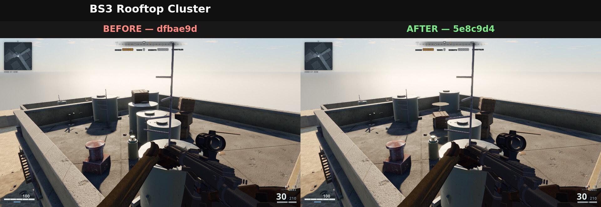

### 2. Satellite-dish pair

`sat_dish/0005`, `sat_dish/0006`

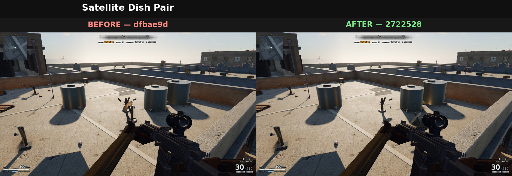

### 3. Gas-bottle pair

`gas_bottle/0002`, `gas_bottle/0003`

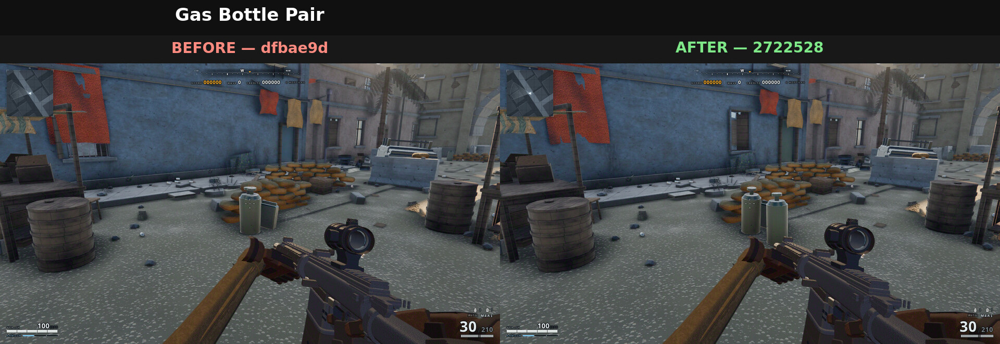

### 4. Cardboard-box pair

`box_card_a/0012`, `box_card_a/0013`

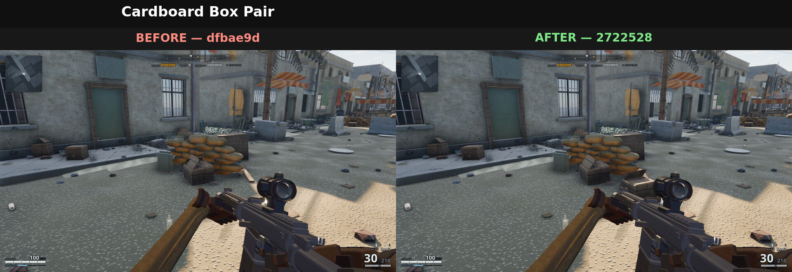

### 5. West planter pair

`planter/0013`, `planter/0014`. Resolution: retain `0013`; remove redundant `0014` rather than moving it into the next balcony.

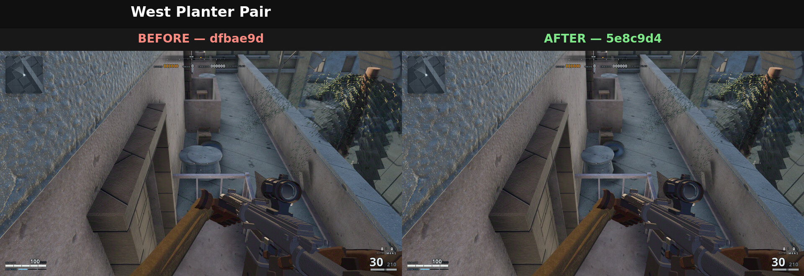

### 6. East planter pair

`planter/0022`, `planter/0023`. Resolution: retain `0022`; remove redundant `0023` rather than moving it into the next balcony.

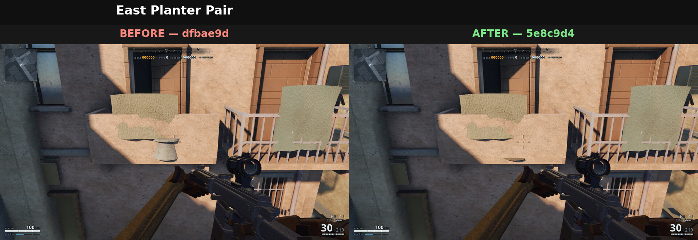

## AC-unit pairs

### 7. W4 façade

`ac_unit/0009`, `ac_unit/0010`

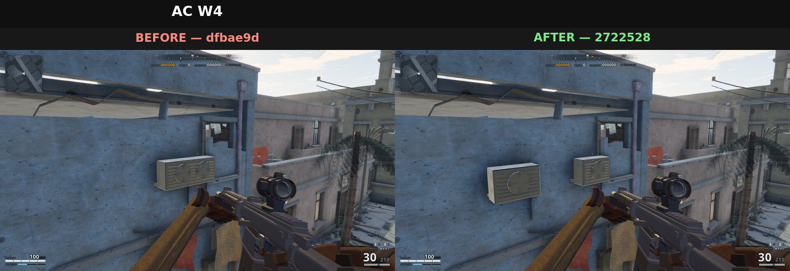

### 8. BW2 west façade

`ac_unit/0017`, `ac_unit/0018`

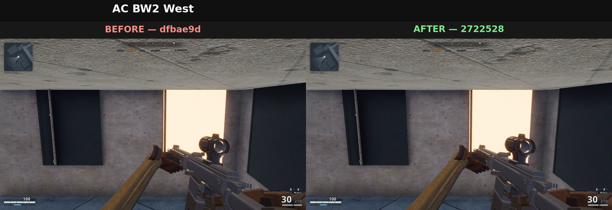

### 9. BE1 façade

`ac_unit/0073`, `ac_unit/0074`. Resolution: retain the backed wall unit; remove window-obstructing `0074`.

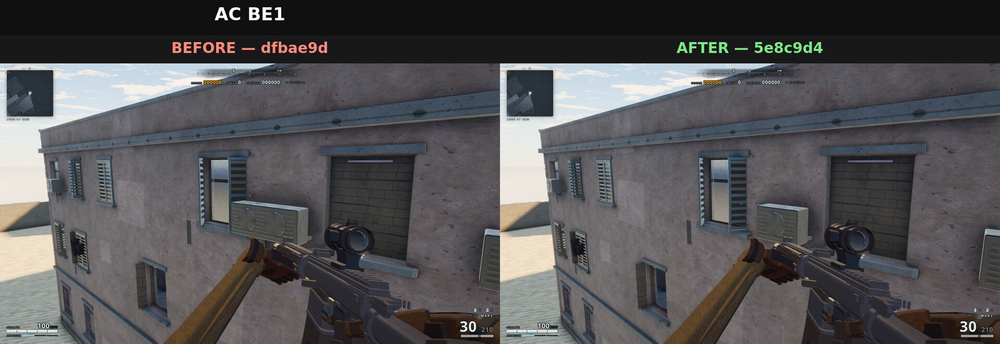

### 10. BE3 façade

`ac_unit/0083`, `ac_unit/0084`

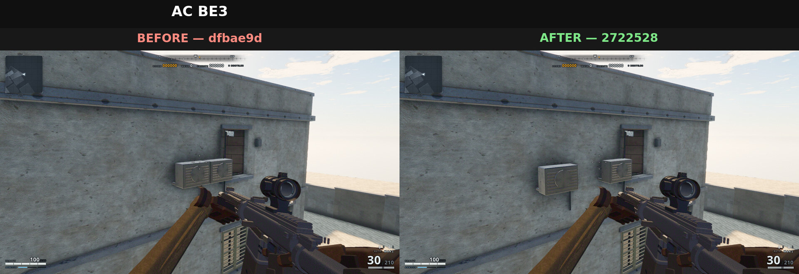

### 11. BN2 corner

`ac_unit/0101`, `ac_unit/0102`

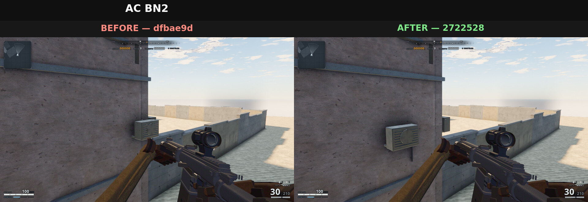

### 12. E5 corner

`ac_unit/0024`, `ac_unit/0025`. Resolution: remove both redundant units because neither available corner position clears the windows.

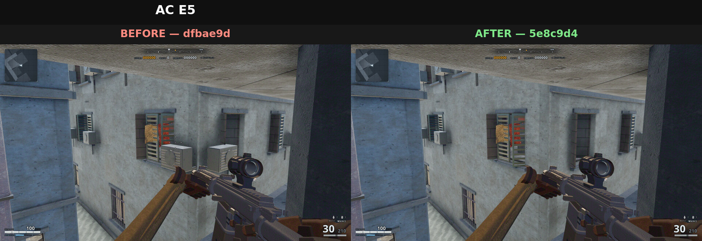

### 13. BW1 façade

`ac_unit/0061`, `ac_unit/0062`. Resolution: remove both redundant units because the gap between windows cannot hold one cleanly.

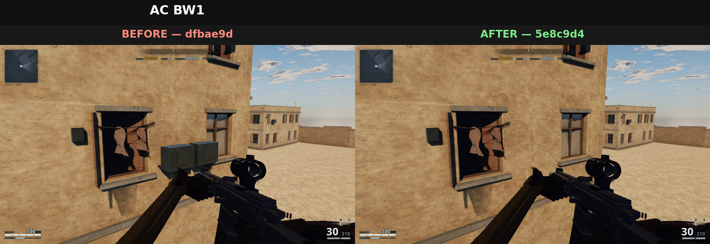

### 14. BE2 façade

`ac_unit/0080`, `ac_unit/0081`. Resolution: retain `0080`; remove window-obstructing `0081`.

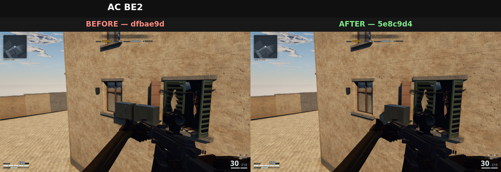

### 15. BS3 façade

`ac_unit/0095`, `ac_unit/0096`

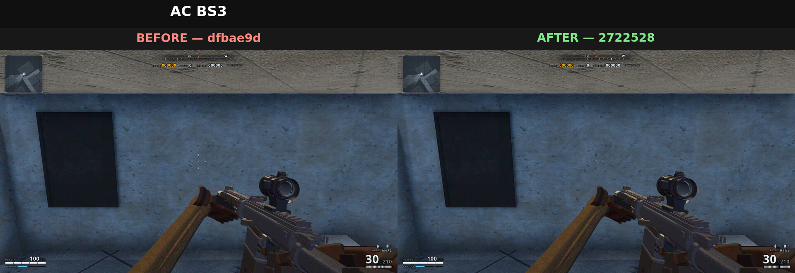

### 16. BW2 north façade

`ac_unit/0006`, `ac_unit/0007`

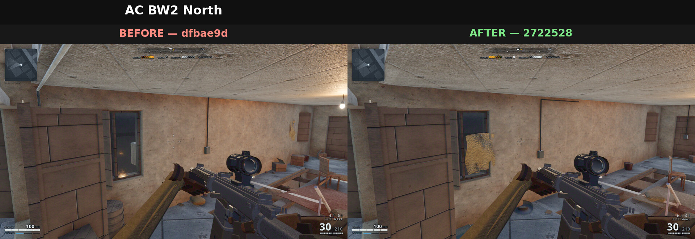

## Procedurally generated collisions

### 17. Gate jersey and concrete block

`_auto/0414` (`jersey`), `block_big/0007`

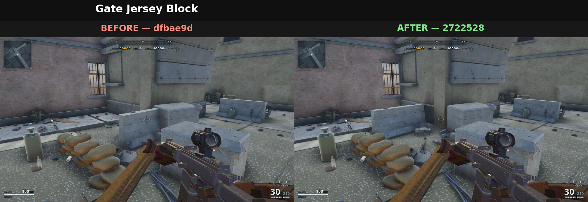

### 18. E1 barrel and shelf

`_auto/0165` (`barrel_wood`), `_auto/0477` (`shelf`)

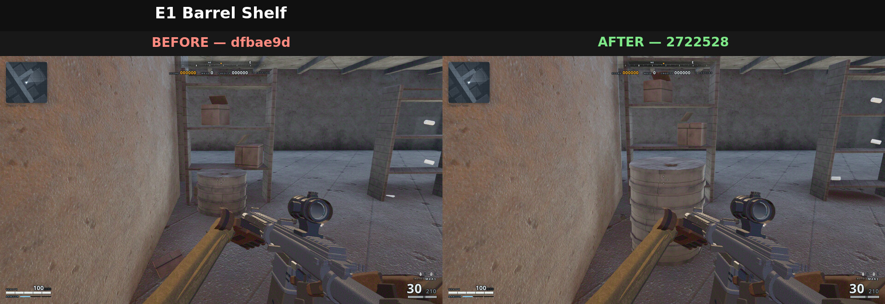

### 19. W2 upper-floor barrel and cabinet

`_auto/0158` (`barrel_wood`), `_auto/0509` (`cabinet`)

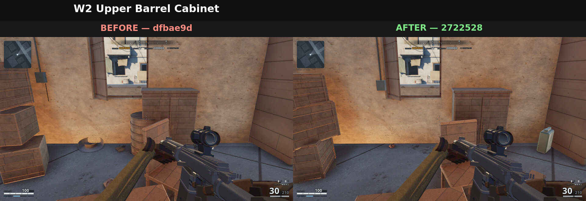

### 20. W2 ground-floor barrel and shelf

`_auto/0153` (`barrel_wood`), `_auto/0472` (`shelf`)

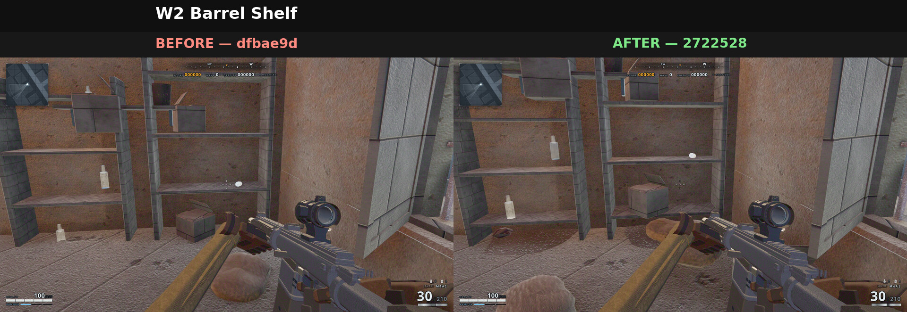

### 21. W3 pallet pair

`_auto/0462`, `_auto/0463` (`pallet`)

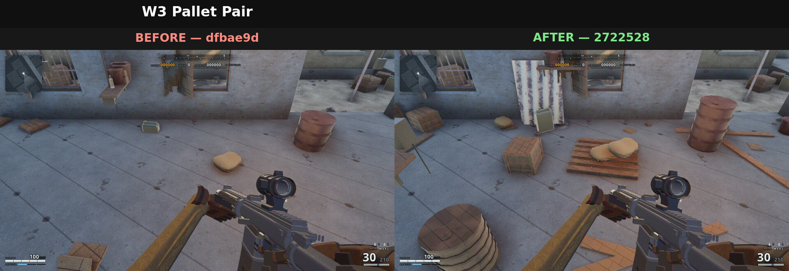

### 22. W2 upper-floor box and cabinet

`_auto/0075` (`box_card_a`), `_auto/0510` (`cabinet`)

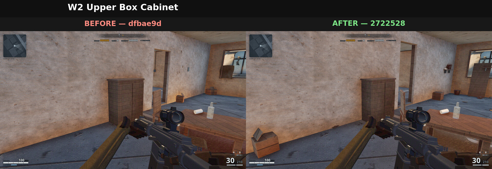

### 23. W3 box and barrel

`_auto/0079` (`box_card_a`), `_auto/0164` (`barrel_wood`)

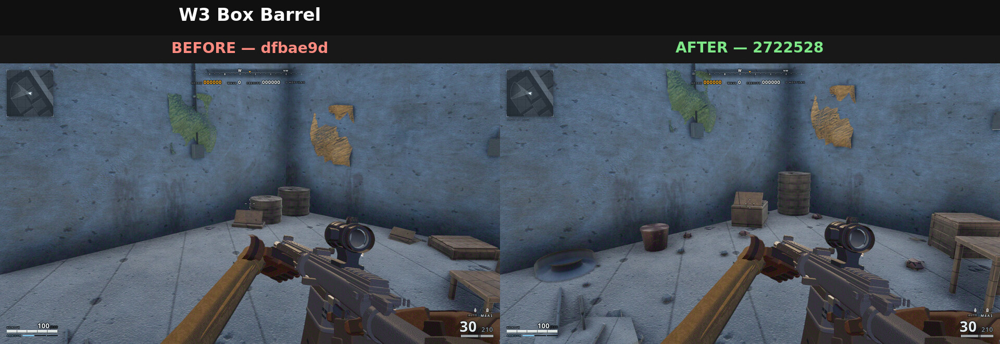

### 24. E3 barrel and rebar

`_auto/0170` (`barrel_wood`), `rebar/0003`

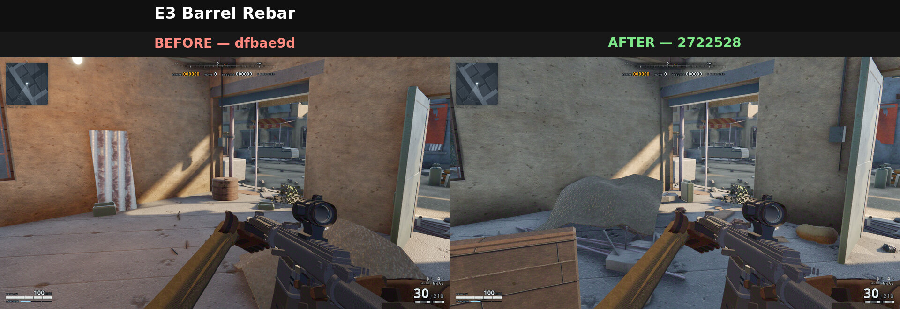

### 25. W2 mattress and barrel

`_auto/0162` (`barrel_wood`), `_auto/0485` (`mattress`)

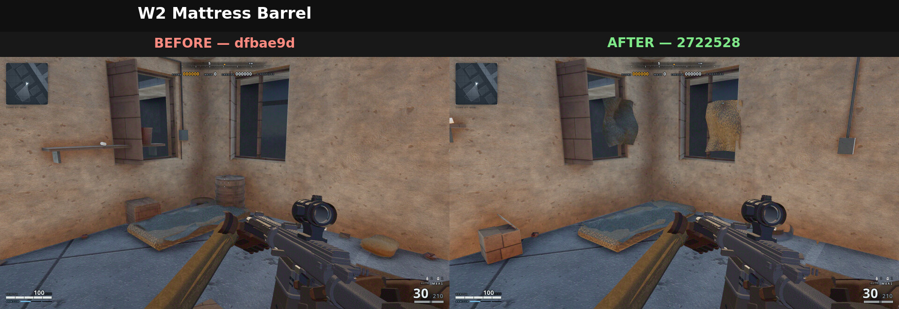
